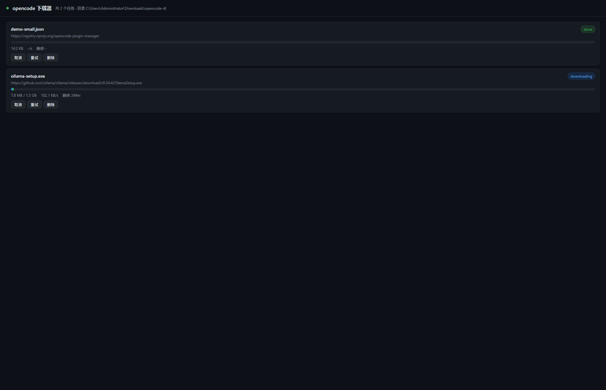

# OpenCode Downloader

**后台下载 · 本地进度面板 · 完成后自动通知 AI**  
**Background downloads · Local dashboard · Automatic AI notifications**

[中文](#中文) · [English](#english) · [MIT License](LICENSE)



> 由项目维护者发起，GPT-6.1 Sol 与 **DeepSeek V4.1 Flash** 共同创作。  
> Created at the maintainer's direction, collaboratively by GPT-6.1 Sol and **DeepSeek V4.1 Flash**.

## 中文

面向 [OpenCode V2](https://opencode.ai/v2/docs/build/plugins) 的本地插件。AI 启动下载后可以继续其他工作；插件在后台下载文件或拉取 Ollama 模型，并在完成或失败时通知发起任务的会话。浏览器面板展示进度、速度和预计剩余时间，无需 AI 持续调用工具查询。

### 功能

- HTTP/HTTPS 文件下载，并发数可设为 1～16，默认 3。
- 自定义目录、文件名、SHA-256 校验和限速。
- 独立 `.part` 临时文件，成功后发布成品，不覆盖已有文件。
- GitHub 下载可尝试原地址及 3 个第三方镜像，可按任务关闭。
- 本地 Ollama 模型拉取与进度显示。
- 自动向发起任务的会话通知成功或失败，可关闭自动通知。
- 本地面板支持取消、重试和移除记录；无额外 npm 运行依赖。

### 安装

需要支持 V2 插件接口的 OpenCode。开发检查与测试需要 **Node.js 22.18+，推荐 Node.js 24 LTS**。Ollama 功能需要本机服务运行在 `127.0.0.1:11434`。

下载或克隆仓库，把 `downloader.ts` 复制到以下任一位置，再重启 OpenCode：

| 范围 | 插件路径 |
| --- | --- |
| 全局 | `~/.config/opencode/plugins/downloader.ts` |
| 当前项目 | `.opencode/plugins/downloader.ts` |
| Windows 全局示例 | `%USERPROFILE%\.config\opencode\plugins\downloader.ts` |

**目前提供源码安装，尚未发布 npm 包。** 安装插件无需 `npm install`；npm 依赖只用于开发检查和测试。

### 使用

直接告诉 AI：

```text
帮我下载 https://example.com/model.gguf 到 D:\Models，
文件名用 model.gguf，完成后告诉我。
```

也可以让 AI 使用 `dl.add`，参数示例：

```json
{
  "url": "https://example.com/model.gguf",
  "dir": "D:\\Models",
  "name": "model.gguf",
  "max_mbps": 5,
  "mirror": false
}
```

默认目录是 `~/Downloads/opencode-dl`。`max_mbps` 单位为 **MiB/s**（每秒 1024² 字节），`0` 不限速。校验参数 `sha256` 应为 64 位十六进制字符串。

用 `dl.open` 打开面板，或访问 <http://127.0.0.1:17890/>。Windows/macOS/Linux 分别使用系统 `start`、`open`、`xdg-open`；没有启动命令时可手动访问地址。

| 工具 | 用途 |
| --- | --- |
| `dl.add` | 下载文件；支持 `url`、`name`、`dir`、`sha256`、`mirror`、`max_mbps` |
| `dl.ollama` | 拉取指定 `model`，例如 `qwen3:8b` |
| `dl.list` | 查看任务、文件路径、速度和通知结果 |
| `dl.cancel` | 用 `id` 取消排队、下载或校验中的任务 |
| `dl.retry` | 用 `id` 重试失败或已取消的任务，需等待清理结束 |
| `dl.remove` | 用 `id` 移除已结束任务的记录，保留成品 |
| `dl.clear` | 清除已结束任务的记录，保留成品 |
| `dl.open` | 打开本地面板 |
| `dl.config` | 设置默认 `dir`、`auto_notify`、`auto_mirror`、`max_mbps`、`max_concurrent` |

### 网页设置


面板顶部可设置下载目录、并发任务数、默认 HTTP 单任务限速、自动通知和 GitHub 镜像回退。点击“保存”后，设置写入 `~/.config/opencode/downloader.json`，重启后恢复；环境变量 `OPENCODE_DOWNLOADER_CONFIG` 可指定其他配置路径。

- 并发数范围 1～16，HTTP 和 Ollama 共用名额。增加上限立即调度排队任务；降低上限不终止正在运行的任务。
- 默认限速实时作用于未设置独立限速的 HTTP 任务，**不是全部任务共享的总带宽上限**。
- 每个排队或下载中的 HTTP 任务可设置独立限速；留空并点击“应用”可恢复跟随默认，填 `0` 为不限速。
- 目录和镜像设置影响新任务；自动通知设置在任务结束时生效。
- **Ollama 是可选功能**，无需安装即可使用普通文件下载；模型拉取不应用 HTTP 限速。

### 行为与限制

- 下载在 **OpenCode 进程内**运行。关闭会话界面不必然停止下载，但退出或重启 OpenCode 会中止任务；任务记录不持久化。
- 重试从头下载，尚无断点续传。进程异常退出可能留下 `.part` 文件，确认任务停止后可手动删除。
- 已存在或正在下载的目标会被拒绝。成品通过同目录硬链接发布，文件系统需支持硬链接，否则会报告失败。
- 通知依赖 OpenCode 会话接口。通知失败会记录在任务及系统临时目录的 `downloader-notify.log` 中，不影响已下载成品。
- 镜像是第三方服务，可能不可用，且会接收原始 URL。私有资源或含敏感查询参数的地址应设置 `mirror: false`；重要文件建议提供发布者的 SHA-256。
- 不支持 URL 内嵌用户名密码，也没有自定义认证请求头。
- 取消 Ollama 会中止客户端请求；服务端是否立即停止由 Ollama 决定。
- 面板只监听 `127.0.0.1`，默认端口 `17890`，不用于公网部署。端口被其他实例占用时，先停止该实例。
- 回归测试使用模拟 OpenCode V2 上下文和本地 HTTP 服务；真实 Ollama、第三方镜像及不同 OpenCode 版本仍需实际验证。

### 开发与贡献

```sh
npm ci
npm run check
npm test
```

CI 在 Windows、macOS 和 Linux 上运行类型检查与测试。欢迎 Issues 和 Pull Requests。报告问题请附操作系统、OpenCode/Node.js 版本、复现步骤及去除敏感参数的错误信息。

### 共同创作

维护者负责需求、方向与发布。**DeepSeek V4.1 Flash** 完成初始实现和交接文档；**GPT-6.1 Sol** 完成下载生命周期、文件保护、面板安全、跨平台浏览器启动、回归测试、CI 和双语文档的改进。双方在维护者指导下共同创作；本项目不是 OpenCode、OpenAI 或 DeepSeek 官方产品。

## English

A local plugin for [OpenCode V2](https://opencode.ai/v2/docs/build/plugins). An agent can start a file download or an Ollama model pull, continue other work, and receive a success or failure notification in the originating session. A browser dashboard shows progress, speed, and estimated time remaining without repeated tool polling by the agent.

### Features

- HTTP/HTTPS downloads with configurable concurrency from 1 to 16 (default 3).
- Custom directories and filenames, SHA-256 verification, and rate limits.
- Separate `.part` files, with completed files published without overwriting existing destinations.
- Optional GitHub fallback through the original URL and three third-party mirrors, configurable per task.
- Local Ollama model pulls with progress reporting.
- Optional automatic success/failure notifications to the originating session.
- A local dashboard for cancellation, retries, and record removal; no additional npm runtime dependencies.

### Installation

Use OpenCode with the V2 plugin interface. Development checks and tests require **Node.js 22.18+, preferably Node.js 24 LTS**. Ollama pulls require a local server at `127.0.0.1:11434`.

Download or clone the repository, copy `downloader.ts` to one of these locations, and restart OpenCode:

| Scope | Plugin path |
| --- | --- |
| Global | `~/.config/opencode/plugins/downloader.ts` |
| Project | `.opencode/plugins/downloader.ts` |
| Windows global example | `%USERPROFILE%\.config\opencode\plugins\downloader.ts` |

**Installation currently uses the source file; an npm package has not been published.** You do not need `npm install` to install the plugin. npm dependencies are for development checks and tests only.

### Usage

Ask the agent:

```text
Download https://example.com/model.gguf to ~/Models as model.gguf,
and let me know when it finishes.
```

Or request `dl.add` with arguments such as:

```json
{
  "url": "https://example.com/model.gguf",
  "name": "model.gguf",
  "max_mbps": 5,
  "mirror": false
}
```

The default directory is `~/Downloads/opencode-dl`. `max_mbps` uses **MiB/s** (1024² bytes per second); `0` means unlimited. Supply a 64-character hexadecimal `sha256` to verify a file.

Use `dl.open` or visit <http://127.0.0.1:17890/>. Browser launching uses `start` on Windows, `open` on macOS, and `xdg-open` on Linux. Open the URL manually if a launch command is unavailable.

| Tool | Purpose |
| --- | --- |
| `dl.add` | Download with `url`, `name`, `dir`, `sha256`, `mirror`, and `max_mbps` |
| `dl.ollama` | Pull a `model`, such as `qwen3:8b` |
| `dl.list` | Show tasks, destinations, speeds, and notification results |
| `dl.cancel` | Cancel a queued, downloading, or verifying task by `id` |
| `dl.retry` | Retry a failed/canceled task by `id` after cleanup completes |
| `dl.remove` | Remove a finished task record by `id`, keeping its file |
| `dl.clear` | Remove finished task records, keeping downloaded files |
| `dl.open` | Open the dashboard |
| `dl.config` | Set default `dir`, `auto_notify`, `auto_mirror`, `max_mbps`, and `max_concurrent` |

### Dashboard settings

Use the settings form to change the directory, concurrency, default HTTP per-task rate, notifications, and GitHub mirror fallback. Saving persists settings to `~/.config/opencode/downloader.json`, restored on restart. Set `OPENCODE_DOWNLOADER_CONFIG` to use a different configuration path.

- Concurrency ranges from 1 to 16, shared by HTTP and Ollama tasks. Raising it immediately starts queued tasks; lowering it never interrupts active tasks.
- The default rate applies live to HTTP tasks without overrides. It is **not an aggregate bandwidth cap**.
- Queued/downloading HTTP tasks have individual rate controls. Leave the field blank and click Apply to inherit the default; `0` means unlimited.
- Directory and mirror changes affect new tasks. Notification settings are checked when a task finishes.
- **Ollama is optional**; ordinary file downloads do not require it. HTTP rate limits do not apply to model pulls.

### Behavior and limitations

- Downloads run **inside the OpenCode process**. Closing a session view does not necessarily stop them, but quitting/restarting OpenCode does. Task records are not persisted.
- Retries restart downloads; resumable downloads are not implemented. A crash may leave `.part` files, removable after the corresponding task has stopped.
- Existing and reserved destinations are rejected. Publication uses a same-directory hard link; filesystems without hard-link support will report a failure.
- Notifications depend on OpenCode's session API. Failures are recorded in the task and `downloader-notify.log` in the system temporary directory; completed files are retained.
- Mirrors are third-party services, may be unavailable, and receive the original URL. Use `mirror: false` for private resources or sensitive query parameters. Verify important files with the publisher's SHA-256.
- Embedded URL credentials and custom authentication headers are not supported.
- Canceling an Ollama task aborts the client request; immediate server-side cancellation depends on Ollama.
- The dashboard listens only on `127.0.0.1`, using port `17890` by default. It is not a public download service. Stop another instance occupying the port before starting a new one.
- Regression tests use a mocked OpenCode V2 context and local HTTP fixtures. Real Ollama, mirrors, and compatibility across OpenCode versions still require environmental testing.

### Development and contributions

```sh
npm ci
npm run check
npm test
```

CI runs type checks and tests on Windows, macOS, and Linux. Issues and pull requests are welcome. Include your operating system, OpenCode/Node.js versions, reproduction steps, and errors with sensitive parameters removed.

### Collaborative creation

The maintainer provided requirements, direction, and publication decisions. **DeepSeek V4.1 Flash** created the initial implementation and handoff documentation. **GPT-6.1 Sol** improved download lifecycle handling, file protection, dashboard security, cross-platform browser launching, regression tests, CI, and bilingual documentation. This is a collaborative project directed by its maintainer, not an official OpenCode, OpenAI, or DeepSeek product.

## License

[MIT](LICENSE).
